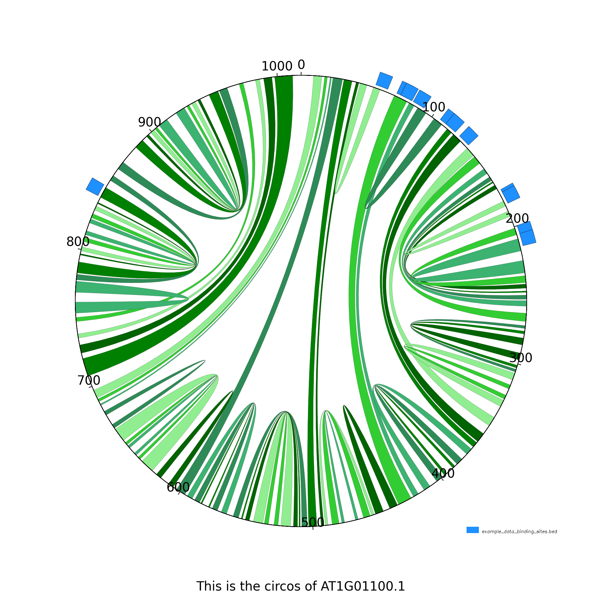
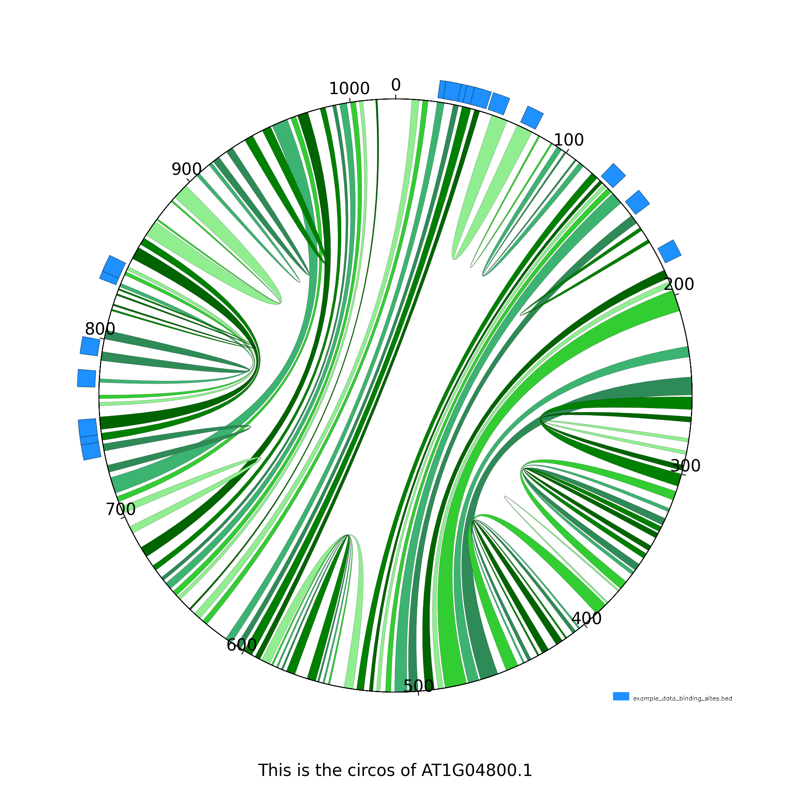
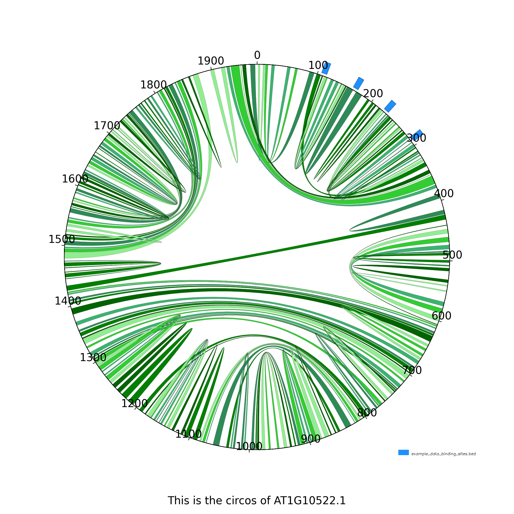
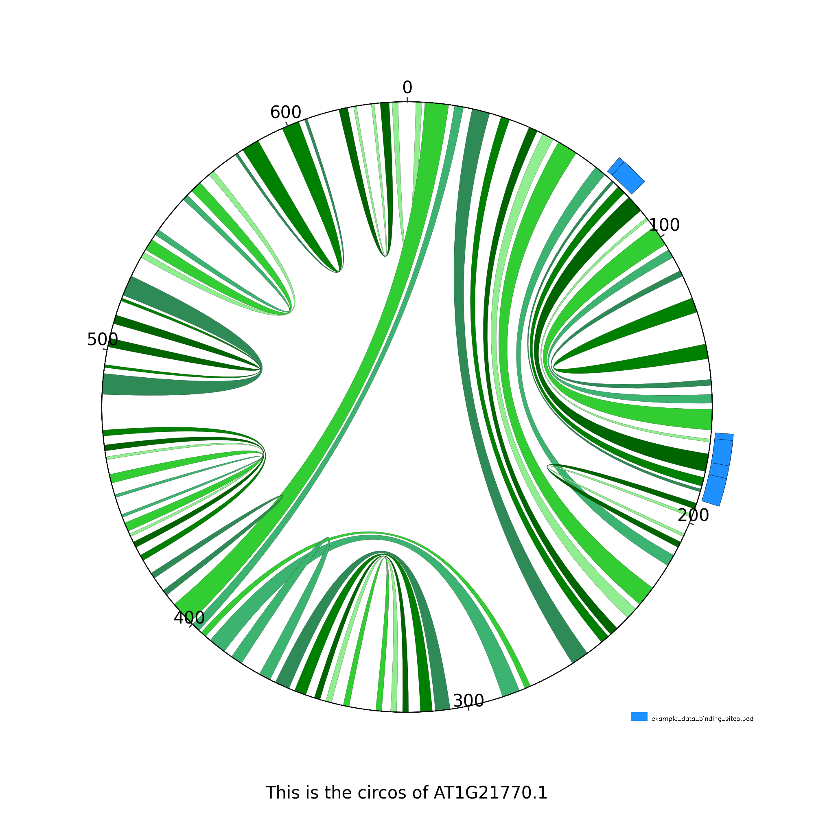
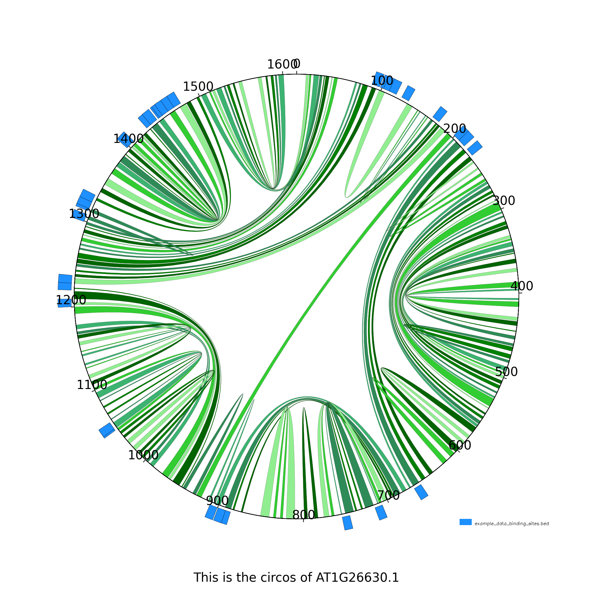
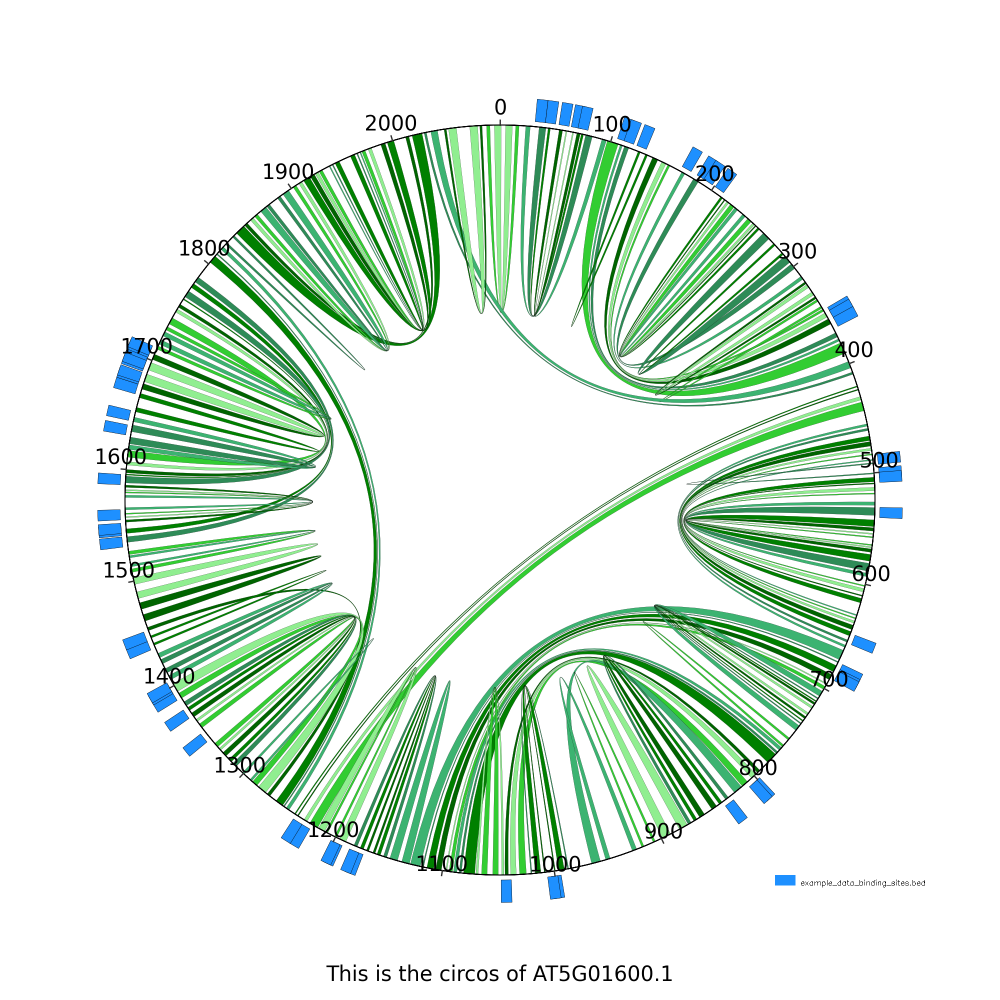

# gen-circos-plot
The program gen-circos-plot is used to visualize 2D miRNA folding and protein binding sites. It uses miRNA coordinates (BED file), the mapped binding sites (BED file) and the genome (FASTA file) to create a CIRCOS plot of the folded miRNA with binding sites marked. The package pyCircos is used for this.

## Installation

`git clone https://github.com/mloskant/gen-circos-plot.git`

## Installation of pyCircos
`pip install python-circos` or see https://github.com/ponnhide/pyCircos

## Command line flags are:
- `-g` or `--genes` : The genes in BED format
- `-b` or `--bindings` : The binding sites of proteins in BED format
- `-fi` or `--fasta` : The chromosomal sequences as a fasta file
- `-o` or `--output` : Name of the folder in which all pngs are saved

## Example: 
You must first <em>sample_data/example_data_TAIR10_chr_all.fas.gz</em> unpack and then:

`python3 gencircosplot.py --genes sample_data/example_data_genes.bed --bindings sample_data/example_data_binding_sites.bed --fasta sample_data/example_data_TAIR10_chr_all.fas -o circoplots`

# Gallery

# Dependencies
python 3.10 or later

# License
MIT License
